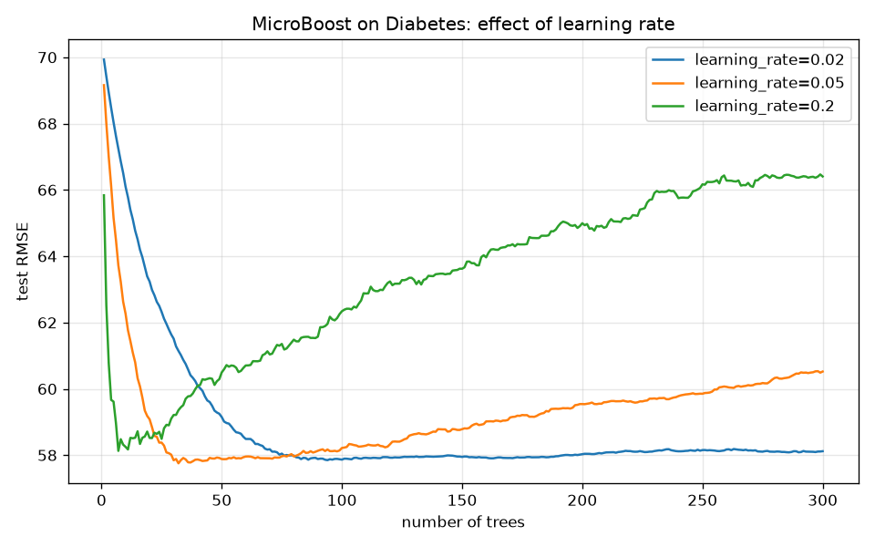

# MicroBoost

**Gradient boosting from scratch in ~350 lines of NumPy — and it matches scikit-learn.**

MicroBoost is a small, heavily-commented implementation of gradient boosted
decision trees, written to understand the algorithm rather than to replace a
production library. It includes a from-scratch CART regressor, a stagewise
boosting loop with pluggable loss functions, a test suite, and reproducible
experiments that benchmark it head-to-head against `scikit-learn`.



*Test RMSE vs number of trees on the Diabetes dataset. A large learning rate
(0.2) drives the training error down fast but overfits — the classic
bias/variance trade-off that motivates shrinkage and early stopping.*

---

## Why this project

Gradient boosting is one of the most effective algorithms for tabular data, but
most people (myself included, at first) use it as a black box. I built
MicroBoost to answer a concrete question: *if I implement the algorithm exactly
as described by Friedman (2001), starting from raw NumPy, how close do I get to
a mature library?*

The answer, on standard benchmark datasets, is **within ~0.1% RMSE**.

## Results

Reproduced with the scripts in [`experiments/`](experiments/). Both models use
identical hyperparameters; scikit-learn is the reference.

### Regression — Diabetes (`n_estimators=200, lr=0.05, max_depth=2`)

| model         |   RMSE |    MAE |    R² |
|---------------|-------:|-------:|------:|
| MicroBoost    | 59.541 | 46.984 | 0.286 |
| scikit-learn  | 59.502 | 46.981 | 0.287 |

RMSE gap vs scikit-learn: **+0.039** (0.07%).

### Classification — Breast Cancer (`n_estimators=150, lr=0.1, max_depth=3`)

| model         | accuracy | log-loss |
|---------------|---------:|---------:|
| MicroBoost    |    0.951 |    0.183 |
| scikit-learn  |    0.951 |    0.218 |

## How it works

Gradient boosting builds an additive model stagewise. Starting from a constant
`F₀`, each new tree is fit to the **negative gradient** of the loss at the
current prediction — i.e. every tree takes one step of gradient descent in
function space:

```
Fₘ(x) = Fₘ₋₁(x) + η · hₘ(x),   where hₘ ≈ −∂L/∂F
```

- For **squared error**, the negative gradient is just the residual `y − F`,
  recovering classic least-squares boosting.
- For **logistic loss**, it is `y − sigmoid(F)`, the label minus the predicted
  probability.

The learning rate `η` (shrinkage) and optional row `subsample` are the two
knobs that trade fitting speed against generalisation.

See [`docs/report.md`](docs/report.md) for the full write-up: method,
experimental setup, and discussion.

## Repository layout

```
microboost/
├── microboost/
│   ├── tree.py        # CART regression tree (greedy SSE splits, prefix sums)
│   ├── losses.py      # SquaredError and LogisticLoss (init + neg. gradient)
│   ├── boosting.py    # GradientBoostingRegressor / Classifier
│   └── metrics.py     # rmse, mae, r2, accuracy
├── experiments/       # benchmarks vs scikit-learn + learning-curve plot
├── tests/             # pytest suite (16 tests)
└── docs/report.md     # methodology and results
```

## Quick start

```bash
python -m venv .venv && source .venv/bin/activate
pip install -e ".[experiments,dev]"

# run the test suite
pytest -q

# reproduce the benchmarks
python experiments/run_regression.py
python experiments/run_classification.py
python experiments/plot_learning_curves.py
```

### Using it as a library

```python
import numpy as np
from microboost import GradientBoostingRegressor

X = np.random.default_rng(0).normal(size=(500, 5))
y = X[:, 0] ** 2 + np.sin(X[:, 1])

model = GradientBoostingRegressor(n_estimators=200, learning_rate=0.05, max_depth=3)
model.fit(X, y)
preds = model.predict(X)

# inspect the training curve, or use staged_predict for early stopping
print(model.train_loss_[-1])
```

The API intentionally mirrors the small slice of scikit-learn that the
experiments touch (`fit`, `predict`, `predict_proba`, `staged_predict`), so
models are close to drop-in.

## Design notes & limitations

- Splits are found with prefix sums, so each feature costs `O(n log n)`
  (dominated by the sort) rather than `O(n²)`.
- Only numeric features are supported; there is no missing-value handling.
- Leaf values use the mean pseudo-residual rather than a per-leaf Newton step.
  Adding the Newton refinement (as in `TreeBoost`/XGBoost) would likely close
  the small remaining gap on the classification log-loss — noted as future
  work.

## References

1. J. H. Friedman. *Greedy Function Approximation: A Gradient Boosting
   Machine.* Annals of Statistics, 2001.
2. T. Hastie, R. Tibshirani, J. Friedman. *The Elements of Statistical
   Learning*, 2nd ed., ch. 10.
3. scikit-learn, `sklearn.ensemble.GradientBoostingRegressor` (reference
   implementation used for benchmarking).

## License

MIT — see [LICENSE](LICENSE).
